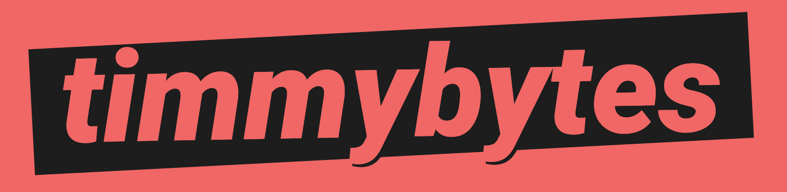
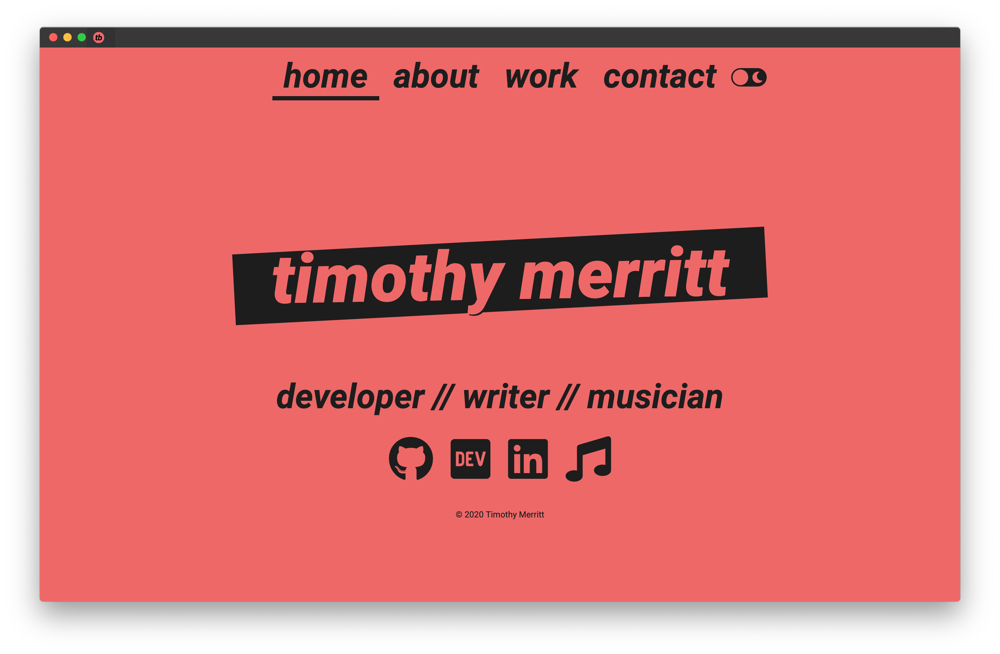

<h1 align="center">
  
</h1>

  
  
  

  <strong>A personal portfolio</strong>

  Built with ❤︎ by (and for)
  <a href="https://timmybytes.com">Timothy Merritt</a>

This is the repository for my personal website/portfolio <https://timmybytes.com>. It was built with HTML, SCSS, JavaScript, and some NPM scripts for automating compiling/deployment.

The site was created to my own tastes as I was (and am) learning to better refine things to my own preferences and best practices. As such, it is not a project intended to be maintained broadly, or meant to be forked, so it might break your stuff.

Feel free to take anything that's helpful, however!

Light Mode

Dark Mode

This is my personal portfolio site, built from scratch with HTML, SCSS, and Vanilla JavaScript. The goal of this project was to build a complete website and create a home for my web development projects.

While it isn't meant to be forked, since this site is tailored for my own needs, feel free to use anything useful you find within the site template for your own projects.

This work is all under the [MIT License](./LICENSE).
