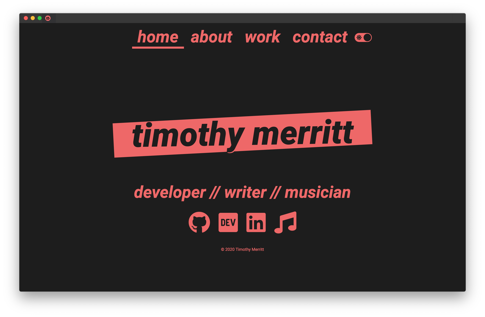

<h1 align="center">
  
</h1>

  
  
  

  <strong>A personal portfolio</strong>

  Built with ❤︎ by (and for)
  <a href="https://timmybytes.com">Timothy Merritt</a>

This is the repository for my personal website/portfolio <https://timmybytes.com>. It was built with HTML, SCSS, JavaScript, and some NPM and bash scripts for automating compiling/deployment.

The site was created to my own tastes as I was (and am) learning to better refine things to my own preferences and best practices. As such, it is not a project intended to be maintained broadly, or meant to be forked, so it might break your stuff.

Feel free to take anything that's helpful, however!

## Screens

  
  Light mode

  
  Dark mode

## License

This template is under the [MIT License](./LICENSE).

Original works on timmybytes.com and the **timmybytes** name are © Timothy Merritt.

<!-- TODO:
- Consolidate font weights in google api call: 900 800 600 400 100
- Fix footer not becoming visible
- Add CSP to each page
- Fix homepage animation to fade-OUT timmybytes and fade-IN timothy merritt
- Optimize image sizes/formats
- Conduct Accessibility review
-
 -->
